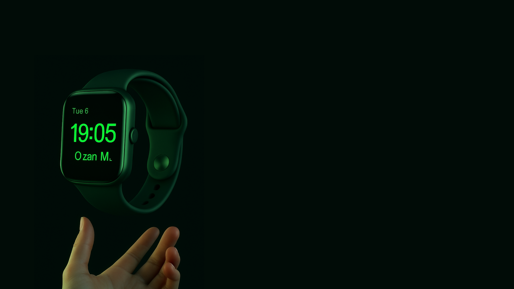

<h1 align="center">⌚ Watch Dashboard</h1>

  

<h2>📌 Proje Özeti</h2>

  Bu proje, saat satış verilerini analiz etmek için geliştirilmiş interaktif bir <strong>Power BI</strong> dashboard'udur.
  Modern tasarım öğeleri, ikonlar ve özel arka plan ile görsel olarak zenginleştirilmiştir.

<h2>✨ Özellikler</h2>
<ul>
  <li>📈 Satış trend analizleri</li>
  <li>📉 Düşüş ve artış grafik ikonları</li>
  <li>🎨 Kullanıcı dostu ve görsel olarak çekici arayüz</li>
  <li>🖼️ PNG formatında özel ikonlar ve arka plan görselleri</li>
</ul>

<h2>📸 Dashboard Ekran Görüntüleri</h2>

<h3>📊 Genel Görünüm</h3>

<h3>📈 Trend Grafik İkonları</h3>

<h3>⬇️ Aşağı Ok İkonları</h3>

<h2>📁 Dosya Açıklamaları</h2>

<table>
  <tr>
    <th>📄 Dosya</th>
    <th>📝 Açıklama</th>
  </tr>
  <tr>
    <td><code>Watch Dashboard.pbix</code></td>
    <td>Power BI dashboard dosyası</td>
  </tr>
  <tr>
    <td><code>backgroud.png</code></td>
    <td>Dashboard arka plan görseli</td>
  </tr>
  <tr>
    <td><code>trend (5).png</code>, <code>trend (6) (1).png</code></td>
    <td>Trend ikon görselleri</td>
  </tr>
  <tr>
    <td><code>down-arrow.png</code>, <code>down-arrow (1).png</code></td>
    <td>Aşağı yön ikonları</td>
  </tr>
</table>

<h2>🌍 English Summary</h2>

  This is an interactive Power BI dashboard project designed to analyze watch sales data, enhanced with modern icons and custom background visuals.

<ul>
  <li>📈 Sales trend analytics</li>
  <li>📉 Up and down chart icons</li>
  <li>🎨 Intuitive and aesthetic interface</li>
  <li>🖼️ Custom PNG visuals</li>
</ul>
